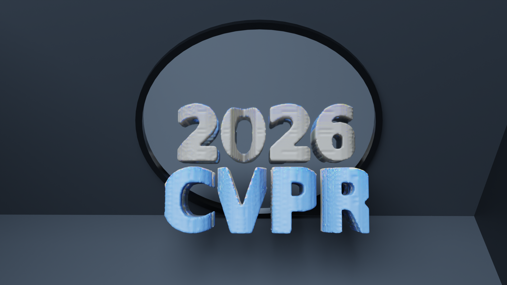
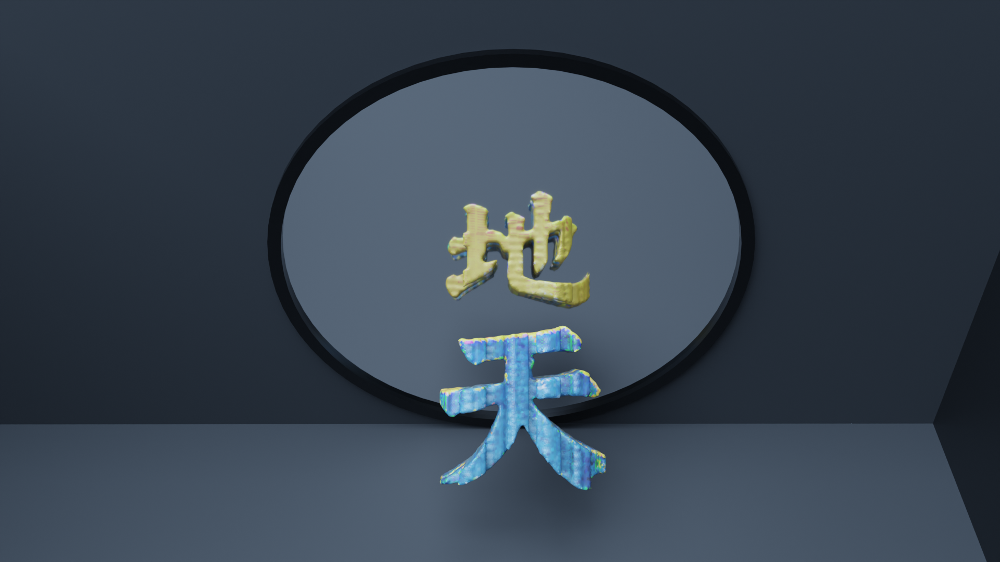
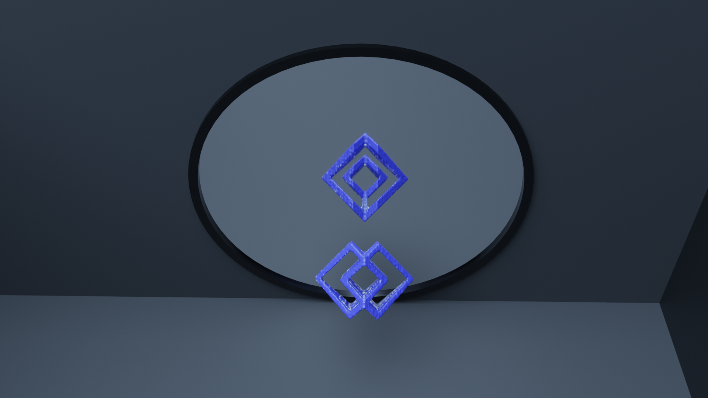
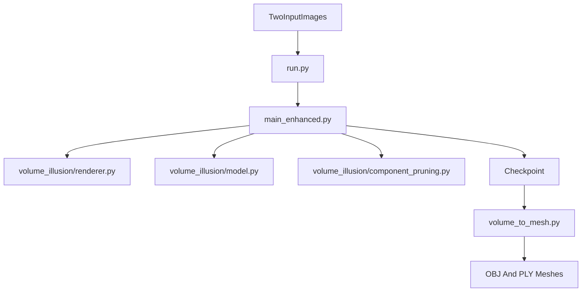

# Mirror Illusion Art (AutoMIA)

[CVPR 2026] This is the official implementation repository for the paper "Mirror Illusion Art" in CVPR 2026. AutoMIA is a PyTorch3D-based system for designing 3D mirror illusion objects from two target images. Given a pair of supervision images, the code jointly optimizes a binary voxelized shape and view-dependent colors, then converts the learned volume into a printable mesh.

## Showcase

<p align="center">
  
  
  
</p>

## Overview

**AutoMIA** combines:

- Dual-view differentiable volume rendering with orthographic or perspective cameras
- Shape-color decoupled optimization for stable inverse design
- Projection-aligned component pruning to suppress floating artifacts
- Interior voxel preservation and mesh smoothing for fabrication-friendly outputs

## Installation

We now provide a reproducible conda environment file in `environment.yml`.

### Conda environment

```bash
conda env create -f environment.yml
conda activate automia
```

If you prefer a one-command setup on Linux, you can also use:

```bash
bash scripts/setup_env.sh
conda activate automia
```

### Environment notes

- Recommended platform: Linux with CUDA 12.1
- Recommended Python version: 3.10
- `environment.yml` installs PyTorch `2.4.1`, torchvision `0.19.1`, and PyTorch3D `0.7.8`
- CPU execution is possible for some steps, but training and mesh generation are intended for GPU use

You can verify that the environment is visible to the project with:

```bash
python run.py --list_gpus
```

## Quick Start

`run.py` is the main file for training and conversion.

The released example supervision images should be placed in `example/`. The command below is the shortest end-to-end path for reproducing AutoMIA with the two example images:

```bash
python run.py \
  --train --convert \
  --supervision_image1 example/<view1_image> \
  --supervision_image2 example/<view2_image> \
  --volume_size 128 \
  --n_iter 800 \
  --lr 0.05 \
  --azim1 0 --azim2 45 \
  --elev1 0 --elev2 -45 \
  --output_dir results
```

Replace `<view1_image>` and `<view2_image>` with the actual filenames of the two example images stored in `example/`.

## What `run.py` does

By default, `run.py` can train a voxel model and convert the latest checkpoint into a mesh. Common patterns are:

### Train and convert

```bash
python run.py \
  --train --convert \
  --supervision_image1 example/<view1_image> \
  --supervision_image2 example/<view2_image>
```

### Train only

```bash
python run.py --train \
  --supervision_image1 example/<view1_image> \
  --supervision_image2 example/<view2_image>
```

### Convert the latest checkpoint only

```bash
python run.py --convert
```

### Convert a specific checkpoint

```bash
python run.py --convert \
  --model_path results/<run_name>/models/<checkpoint>.pt \
  --threshold 0.5 \
  --voxel_size 0.1
```

### Run from a JSON config

```bash
python run.py --config_json configs/v256_default.json --train --convert
```

## Inputs

AutoMIA expects two supervision images:

- `--supervision_image1`: target appearance for view 1
- `--supervision_image2`: target appearance for view 2

The training code loads both silhouette and RGB supervision from these images. RGBA inputs are supported; otherwise the code derives a binary foreground mask from luminance thresholding.

## Outputs

After a successful run, you should expect:

- Training artifacts in `results/binary_voxel_<timestamp>/`
- Intermediate renders and density slices in `results/binary_voxel_<timestamp>/images/`
- A saved checkpoint in `results/binary_voxel_<timestamp>/models/`
- A mesh export in `meshes/<model_name>/<model_name>.obj`
- A companion `.ply` mesh export for downstream visualization

## Useful Arguments

| Argument | Meaning |
|----------|---------|
| `--volume_size` | Voxel resolution, currently `128` or `256` |
| `--n_iter` | Number of optimization iterations |
| `--lr` | Learning rate |
| `--azim1`, `--azim2` | Azimuths for the two supervision views |
| `--elev1`, `--elev2` | Elevations for the two supervision views |
| `--pts_per_ray` | Number of ray samples in the differentiable volume renderer |
| `--render_width`, `--render_height` | Explicit render resolution override |
| `--no_orthographic` | Switch from orthographic to perspective cameras |
| `--shape_ratio` | Fraction of iterations allocated to the shape-first stage |
| `--threshold` | Marching-cubes threshold used during mesh extraction |
| `--smooth_iterations` | Number of smoothing iterations after mesh extraction |

## Method at a Glance

The implementation is centered on four ingredients:

- `PAC`: projection-aligned component pruning
- `PWA`: position-weighted adaptive suppression for background artifacts
- `IVP`: interior voxel preservation to avoid internal fracture
- `SCD`: shape-color decoupled optimization

The high-level data flow is:



## Repository Layout

```text
AutoMIA/
├── README.md
├── environment.yml
├── requirements.txt
├── run.py
├── main.py
├── main_enhanced.py
├── volume_to_mesh.py
├── configs/
│   ├── v256_default.json
│   └── projection_pruning_scoring.md
├── example/
│   └── README.md
├── scripts/
│   ├── setup_env.sh
│   ├── convert_rgb_to_rgba.py
│   └── README_RGB_TO_RGBA.md
└── volume_illusion/
    ├── model.py
    ├── renderer.py
    ├── visualization.py
    └── component_pruning.py
```

## Citation

If you find this repository useful, please cite the AutoMIA CVPR 2026 paper. A camera-ready BibTeX entry can be added here once you are ready to release it publicly.